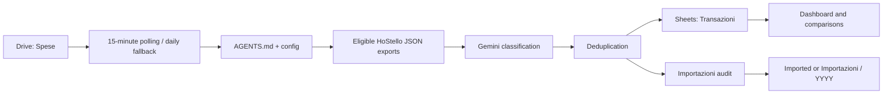

# Google Drive Expenses Cataloger

Google Apps Script automation that imports complete Tricount JSON exports from
a Google Drive intake folder into one canonical Google Sheets ledger. It
preserves exact participant allocations and custom categories, then uses Gemini
only to classify spending in the configured reporting taxonomy.

## Contents

- [Architecture](#architecture)
- [Data model](#data-model)
- [Setup](#setup)
- [Testing](#testing)
- [Documentation](#documentation)
- [Deployment](#deployment)
- [License](#license)

## Architecture



## Data model

`Transazioni` is the single canonical ledger. Each row contains source links,
date-derived year and month, payer, beneficiaries, amount and currency,
transaction type, source type/status, source and custom categories, exact
participant allocations, exchange rate, provenance, AI confidence, and an
immutable duplicate fingerprint. Transfers are excluded from spending totals.
Tricount `INCOME` records retain their negative canonical sign and affect
participant balances. A derived income-reporting type keeps pre-existing cash
and unrelated receipts visible only in the ledger, while purchase refunds
(for example Amazon, Lidl, or a returned purchase) reduce the relevant
spending totals and category charts.
Tricount `Bilancio inizio mese` entries are opening-balance controls rather
than ledger rows. `Bilancio fine mese` entries are recognized closing markers
and are ignored by spending and balance calculations. `Source reconciliations`
proves that every JSON entry and amount has an explicit durable outcome
(imported, duplicate, opening-balance marker, or closing-balance marker).
The editable initial-balance table in `Configurazione` supplies the earliest
usable multi-participant baseline once per currency; later `Bilancio inizio
mese` entries remain reconciliation checks. See the [spreadsheet lifecycle and
schema](docs/SPREADSHEET.md).

## Setup

```sh
make install-check
make install
```

The installer follows the same resumable Google Cloud, Apps Script, Gemini key,
Vertex fallback, and validation workflow as the sibling cataloger. It creates
the Google resources and prints a one-time browser handoff when required.

## Testing

Before the first live import, move candidate source files and folders to
`_Test-fixtures`. Return one or a few untouched source units to the root for
each controlled test.
Tests cover a new import, an exact re-import, a partially overlapping JSON
source, exact custom allocations, and opening- and closing-balance
classification.
No source folder is deleted.

## Documentation

Use the documentation by task:

| Document | Use it for |
| --- | --- |
| [Installation guide](docs/INSTALLATION.md) | Provisioning or adopting a Drive root and spreadsheet |
| [Spreadsheet lifecycle and schema](docs/SPREADSHEET.md) | Tab ownership, default layout, dashboard behavior, and safe customization |
| [Configuration reference](docs/CONFIGURATION.md) | Local configuration, Script Properties, Drive policy, and taxonomy |
| [Operations guide](docs/OPERATIONS.md) | Imports, audits, rebuilds, archival, and recovery |
| [Deployment guide](docs/DEPLOYMENT.md) | Promoting an approved Apps Script revision |

The planned work is in [TODO.md](TODO.md) and delivered changes are in
[CHANGELOG.md](CHANGELOG.md).

## Deployment

Production source deployment happens only after an approved pull request is
merged into `main`; see the [deployment guide](docs/DEPLOYMENT.md).

## License

Licensed under the [MIT License](LICENSE).
