# Deployment Guide

## Contents

- [Flow](#flow)
- [Required secrets](#required-secrets)
- [Secret handoff](#secret-handoff)
- [Repository settings](#repository-settings)

## Flow

Production deployment starts only after an approved pull request is merged
into `main`. The deployment workflow revalidates the merged revision, confirms
the target API executable, preserves the live Apps Script time zone, pushes
project HEAD, creates a numbered version, and updates the stable API
executable.

The production path for `0.2.0` and later releases is:

```mermaid
flowchart LR
  accTitle: Production release promotion
  accDescr: Shows how a release branch becomes the stable Apps Script deployment.
  branch["Create release branch"] --> commit["Commit and push"]
  commit --> pr["Open PR to main"]
  pr --> validation["Validation passes"]
  validation --> approval["Approve and merge"]
  approval --> deploy["Deploy Apps Script workflow"]
  deploy --> gate["Run make check"]
  gate --> stable["Update stable deployment"]
  stable --> triggers["Reconcile managed time triggers"]
```



Use a branch such as `release/0.2.0`; do not prepare the release directly in a
dirty `main` worktree. The pull request validation does not deploy. Merging the
approved PR pushes the exact merge revision to `main`, which triggers
`.github/workflows/deploy-apps-script.yml`. The workflow runs the repository
gate again before moving the stable Apps Script deployment.

A GitHub tag or release does not trigger production deployment. Publish it only
after the merge and successful Apps Script workflow, using the same concrete
version documented in `CHANGELOG.md`.

## Required secrets

Create the GitHub environment `production`, restricted to `main`, and add:

| Secret | Purpose |
| --- | --- |
| `CLASP_AUTH_JSON` | Owner-only clasp authorization JSON, authorized for the Apps Script Deployments and Execution APIs. |
| `CLASP_PROJECT_JSON` | Private `.clasp.json` for the target script. |
| `APPS_SCRIPT_DEPLOYMENT_ID` | Stable owner-only API executable deployment ID. |

The stable deployment ID and its owner-only API-executable entry point are
verified before source upload. The workflow uses the Apps Script Deployments API
to update only the immutable version and description, retaining the entry-point
access configuration. It then recreates only the two managed time triggers from
that promoted deployment. Replacement triggers are created before old ones are
removed, and the job fails if their handler counts are not exactly one each.
Script Properties, Drive sources, spreadsheet data, and Gemini credentials are
not changed by deployment.

`CLASP_AUTH_JSON` must carry the
`https://www.googleapis.com/auth/script.deployments` and
`https://www.googleapis.com/auth/script.projects` OAuth scopes. Re-authorize
clasp with the owner account before adding or replacing that secret if the
workflow reports an insufficient-permission error.

## Secret handoff

Before adding the environment secrets, copy each value into Bitwarden without
printing it to a terminal:

```sh
pbcopy < .installer/clasp-owner-auth.json
pbcopy < .clasp.json
jq -r '.deploymentId' .installer/state.json | pbcopy
```

Save the values as `CLASP_AUTH_JSON`, `CLASP_PROJECT_JSON`, and
`APPS_SCRIPT_DEPLOYMENT_ID`, respectively. Once they are saved, set the GitHub
environment secrets from the local files; do not commit any of them.

## Repository settings

Protect `main`: require pull requests, one approval, fresh approval after new
commits, resolved conversations, and the `Validation / check` status check.
Disable direct pushes. The `production` environment may additionally require
an approval before it releases its secrets.
