# Deployment Guide

## Contents

- [Flow](#flow)
- [Required secrets](#required-secrets)
- [Secret handoff](#secret-handoff)
- [Renew expired OAuth authorization](#renew-expired-oauth-authorization)
- [Repository settings](#repository-settings)
- [Related documentation](#related-documentation)

## Flow

Production deployment starts only after an approved pull request is merged
into `main`. The deployment workflow revalidates the merged revision, confirms
the target API executable, preserves the live Apps Script time zone, pushes
project HEAD, creates a numbered version, and updates the stable API
executable.

The production path for `0.2.0` and later releases is:

```mermaid
flowchart LR
  accTitle: Production release promotion
  accDescr: Shows how a release branch becomes the stable Apps Script deployment.
  branch["Create release branch"] --> commit["Commit and push"]
  commit --> pr["Open PR to main"]
  pr --> validation["Validation passes"]
  validation --> approval["Approve and merge"]
  approval --> deploy["Deploy Apps Script workflow"]
  deploy --> gate["Run make check"]
  gate --> stable["Update stable deployment"]
  stable --> triggers["Reconcile managed triggers"]
```



Use a branch such as `release/X.Y.Z`; do not prepare the release directly in a
dirty `main` worktree. The pull request validation does not deploy. Merging the
approved PR pushes the exact merge revision to `main`, which triggers
`.github/workflows/deploy-apps-script.yml`. The workflow runs the repository
gate again before moving the stable Apps Script deployment.

A GitHub tag or release does not trigger production deployment. Publish it only
after the merge and successful Apps Script workflow, using the same concrete
version documented in `CHANGELOG.md`.

## Required secrets

Create the GitHub environment `production`, restricted to `main`, and add:

| Secret | Purpose |
| --- | --- |
| `CLASP_AUTH_JSON` | Owner-only clasp authorization JSON, authorized for the Apps Script Deployments and Execution APIs. |
| `CLASP_PROJECT_JSON` | Private `.clasp.json` for the target script. |
| `APPS_SCRIPT_DEPLOYMENT_ID` | Stable owner-only API executable deployment ID. |

The stable deployment ID and its owner-only API-executable entry point are
verified before source upload. The workflow uses the Apps Script Deployments API
to update only the immutable version and description, retaining the entry-point
access configuration. It then calls the Apps Script Execution API against that
exact deployment ID in non-development mode to recreate the two managed time
triggers and the dashboard year-color edit trigger. Replacement triggers are
created before old ones are removed, and the job fails if their handler counts
are not exactly one each. If `main`
advances after the stable update, the running job still completes this trigger
repair; the newer revision's deploy will supersede it. Script Properties, Drive
sources, spreadsheet data, and Gemini credentials are not changed by deployment.
If promotion succeeds but trigger repair fails, rerunning that workflow resumes
the repair when the stable deployment still carries the workflow's commit
label, even if `main` has advanced in the meantime.

For spreadsheet provisioning, schema ownership, and managed-dashboard behavior,
see [Spreadsheet lifecycle and schema](SPREADSHEET.md).

Create or renew `CLASP_AUTH_JSON` with the owner account using
`clasp login --use-project-scopes --include-clasp-scopes`. This retains the
manifest's runtime scopes and clasp's `script.deployments` and
`script.projects` scopes needed by the deployment update and non-development
trigger reconciliation. Re-authorize before replacing the secret if the
workflow reports an insufficient-permission error.

## Secret handoff

Before adding the environment secrets, copy each value into Bitwarden without
printing it to a terminal:

```sh
pbcopy < .installer/clasp-owner-auth.json
pbcopy < .clasp.json
jq -r '.deploymentId' .installer/state.json | pbcopy
```

Save the values as `CLASP_AUTH_JSON`, `CLASP_PROJECT_JSON`, and
`APPS_SCRIPT_DEPLOYMENT_ID`, respectively. Once they are saved, set the GitHub
environment secrets from the local files; do not commit any of them.

## Renew expired OAuth authorization

If the deployment reports `invalid_grant`, the stored refresh token is invalid
or expired. For an external OAuth app left in `Testing`, Google can expire
authorizations requesting non-basic scopes after seven days. This is an OAuth
credential problem, not a reason to recreate the Apps Script project or stable
deployment.

1. In Google Cloud Console, open **Google Auth Platform > Audience** for the
   project and move an external app to **In production**. This changes consent
   publication status only; it does not publish Apps Script code or change Drive
   and spreadsheet sharing.
2. Under **Clients**, reuse the existing **Desktop** OAuth client used by CI.
   If its secret cannot be downloaded, add a replacement secret. Keep the old
   secret enabled until the replacement passes validation; remove the old one
   only afterward if it is no longer needed.
3. Create an isolated `clasp` authorization with the Apps Script owner account:

   ```bash
   REPAIR_DIR="$(mktemp -d)"
   chmod 700 "$REPAIR_DIR"
   clasp -A "$REPAIR_DIR/.clasprc.json" login \
     --creds "/secure/path/oauth-client.json" \
     --use-project-scopes \
     --include-clasp-scopes
   chmod 600 "$REPAIR_DIR/.clasprc.json"
   ```

   If Google displays the unverified-app warning, the owner must explicitly
   approve the app through **Advanced**. Never use the global clasp profile for
   CI credentials.
4. Before replacing the GitHub secret, verify the target with the same
   deployment API checks used by CI. Confirm the configured script ID and stable
   deployment ID, a numbered version, the `appsscript` manifest, one
   `EXECUTION_API` entry point, and `MYSELF` access.
5. Replace only `CLASP_AUTH_JSON` in the production environment:

   ```bash
   gh secret set CLASP_AUTH_JSON --env production <"$REPAIR_DIR/.clasprc.json"
   gh secret list --env production --json name,updatedAt \
     --jq '.[] | select(.name == "CLASP_AUTH_JSON")'
   ```

   Do not change `CLASP_PROJECT_JSON` or `APPS_SCRIPT_DEPLOYMENT_ID` unless
   independent validation proves that they are wrong.
6. Remove the temporary credential material. With explicit approval, rerun only
   the failed workflow job using `gh run rerun <run-id> --failed`; this step can
   publish Apps Script source.

Never print the OAuth client secret, authorization code, refresh token, or full
`.clasprc.json`. Do not pass credentials in command arguments or commit them.

## Repository settings

Protect `main`: require pull requests, one approval, fresh approval after new
commits, resolved conversations, and the `Validation / check` status check.
Disable direct pushes. The `production` environment may additionally require
an approval before it releases its secrets.

## Related documentation

- [Project overview and documentation index](../README.md)
- [Installation guide](INSTALLATION.md)
- [Spreadsheet lifecycle and schema](SPREADSHEET.md)
- [Configuration reference](CONFIGURATION.md)
- [Operations guide](OPERATIONS.md)
