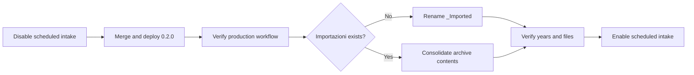

# Operations Guide

## Contents

- [Normal flow](#normal-flow)
- [Review email](#review-email)
- [Duplicate behavior](#duplicate-behavior)
- [Source reconciliation](#source-reconciliation)
- [Initial balances and monthly checks](#initial-balances-and-monthly-checks)
- [Dashboard](#dashboard)
- [Full JSON rebuild](#full-json-rebuild)
- [Archive name migration](#archive-name-migration)
- [Recovery](#recovery)
- [Related documentation](#related-documentation)

## Normal flow

The 15-minute trigger scans direct JSON files in `Spese` and recursively scans
its non-excluded direct-child folders; the daily trigger is the safety net. A
source JSON must match `transactions-*.json` and contain the configured keyword
in its filename. `Ricevute`, `_Test-fixtures`, legacy `_Imported`, and the
localized archive remain untouched.

After a verified import, a root JSON moves as a file to `Imported/YYYY` or
`Importazioni/YYYY`; a JSON inside a folder moves with its closest containing
folder, including that folder's siblings and descendants. An ancestor collection
folder is left in place. The year uses the earliest transaction date in the
import. Cross-year exports therefore remain intact as one source while the
ledger itself partitions values by their actual dates.

Immediately before archival, the runtime rechecks eligible JSON file identities
and content hashes. If the source changes or gains another eligible JSON, the
ledger decisions remain traceable but the source stays in intake for a safe
retry. Root JSON attachment lookup is limited to direct-root sibling files.

Before Gemini classification, the runtime saves the source inventory and
content hashes, validates that snapshot, and stages each completed normalized
JSON result in Drive. A retry reuses completed stages instead of spending AI
quota again. Stage digests use separate bounded Script Properties, so one large
export cannot overflow the main source-state value. Successful archival removes
the source state. Transient stages and digests are removed immediately before
the source move, after ledger and audit verification, so cleanup failure leaves
the source discoverable for retry.

## Review email

The runtime imports a best-supported classification when a confidence is below
the threshold or it conflicts with historical treatment. The email identifies
the date range, source folder and JSON links, entry coordinates and IDs, all
transaction facts, proposed classification, confidence, rationale, and related
conflict.

## Duplicate behavior

The ledger stores a normalized fingerprint of date, amount, currency,
description, payer, and beneficiaries. An exact match already in the ledger is
skipped and written to the import audit. New rows in a partially overlapping
export are imported. The original source JSON and folder remain traceable from
every imported record.

## Source reconciliation

Every processed JSON document receives a durable reconciliation row. It records
its Drive file ID, content SHA-256, source-row count, totals per currency, and
the decision for each source row: `imported`, `duplicate`, or `opening_balance`.
The import can archive only when the source count and monetary totals are fully
accounted for. A duplicate remains part of the reconciliation even though no
second ledger row is created.

Per-person balance views use the exact allocation amounts retained by Tricount.
`Bilancio` entries are opening-balance controls, so they are not spending and
are not imported into the ledger. They validate the prior balance trajectory
without being counted twice.

Cash settlements between participants (including the Tricount custom category
`Contanti`) remain `transfer` rows in `Transazioni`. They update the individual
balance trajectory but are excluded from household-spending KPIs, summaries,
and dashboard charts.

Tricount `INCOME` records, including refunds, retain a negative canonical
amount and allocation sign. They therefore reverse the appropriate participant
balance effect and reduce the associated household-spending category and total.

## Initial balances and monthly checks

The import audit writes a readable `Opening balance details` value for every
detected `Bilancio`: date, currency, participant, amount, and checkpoint
status. The same information remains available in the structured audit field
for the runtime.

`Configurazione` contains one editable initial-balance table per participant
and currency. For a currency, the automatic rows are the complete net vector
from all `Bilancio` entries on the oldest usable date; that vector is applied
once in the cumulative balance calculation. Set `Origine` to `Manuale` to make
an active row override the automatic value. Later monthly `Bilancio` values do
not reset the running balance: `Saldi mensili` compares them with the calculated
month-end position so a mismatch is visible as a checkpoint discrepancy.

During a balance refresh, ledger rows from the pre-allocation schema that have
an empty `Quote partecipanti` field are restored from the linked Tricount JSON
or, for a legacy CSV row, from one unambiguous matching JSON in the managed
archive. This repair never changes classifications or transaction amounts. If
the source JSON is unavailable or ambiguous, the balance view uses the legacy
equal-share fallback and the runtime logs the unresolved source ID.

## Dashboard

The dashboard provides annual category comparison, monthly total comparison by
year, monthly category detail, payer comparison, and top suppliers. KPI cards
and chart data are dynamic queries over the canonical ledger; importing a new
month, year, or category updates them automatically. Use the `Anni da
confrontare` checkboxes for multi-year charts and the `Anno di dettaglio`
dropdown for the category and supplier detail charts. Spending charts use EUR
`expense` and signed `income` rows, so refunds reduce their corresponding
category. They do not mix currencies or count `transfer` and `opening_balance`
records.

The dashboard is a managed Apps Script surface, not a safe home for manual
content. Its full rebuild behavior and the safe customization boundary are in
[Spreadsheet lifecycle and schema](SPREADSHEET.md).

## Full JSON rebuild

`rebuildTransactionsFromTricountJson` is the explicit one-off migration for
the existing historical exports. Each invocation classifies and durably stages
one eligible JSON document outside fixture and archive folders; rerun it until
it returns `REBUILT`. The ledger, audit, and reconciliation rows change only in
that final Gemini-free commit, then the same source-unit archive rules apply.
Before that commit, `resetTricountJsonRebuild` abandons the staged run without
changing the canonical ledger. After the commit is durable, rerun the rebuild
to complete archival; reset deliberately refuses to discard that committed
state.

The rebuild records the discovered JSON inventory and content hashes before
the first AI call. If a staged source changes or a source unit gains another
eligible JSON, the final commit stops before replacing the ledger; reset and
restart the rebuild from the current Drive contents.

## Archive name migration

Version `0.2.0` uses `Importazioni` for an Italian installation and `Imported`
for an English installation. Deployment does not rename the legacy
`_Imported` folder. The legacy name remains excluded from intake, and the
runtime creates the localized archive automatically when it next archives a
source.

Use this flow when consolidating the existing archive under the Italian name:



Before merging the release, pause scheduled intake with the dedicated owner
authorization:

```sh
npx --yes @google/clasp@3.3.0 \
  -A .installer/clasp-owner-auth.json \
  --json run disableExpenseCataloging
```

After the production workflow succeeds:

1. If `Importazioni` does not exist, rename `_Imported` to `Importazioni` in
   Drive. Renaming preserves the folder and its existing year hierarchy.
2. If both folders exist, move the legacy year folders or their contents into
   `Importazioni`. Keep `_Imported` until the merged archive has been checked;
   do not delete source data as part of the migration.
3. Verify the expected years, source folders, and files before re-enabling
   intake.

```sh
npx --yes @google/clasp@3.3.0 \
  -A .installer/clasp-owner-auth.json \
  --json run enableExpenseCataloging
```

If archive consolidation is not required, leave `_Imported` untouched. It will
remain ignored while new imports use `Importazioni/YYYY`.

## Recovery

If a run fails before archiving, correct the configuration or source data and
run the controlled import again. If it fails after a ledger write, consult the
configured archive (`Imported` or `Importazioni`) and the source links before
retrying. Do not delete rows or source folders blindly: the audit exists to
make an intentional correction safe.

## Related documentation

- [Project overview and documentation index](../README.md)
- [Installation guide](INSTALLATION.md)
- [Spreadsheet lifecycle and schema](SPREADSHEET.md)
- [Configuration reference](CONFIGURATION.md)
- [Deployment guide](DEPLOYMENT.md)
