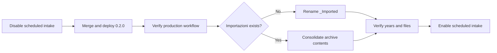

# Operations Guide

## Contents

- [Normal flow](#normal-flow)
- [Review email](#review-email)
- [Duplicate behavior](#duplicate-behavior)
- [Source reconciliation](#source-reconciliation)
- [Dashboard](#dashboard)
- [Full JSON rebuild](#full-json-rebuild)
- [Archive name migration](#archive-name-migration)
- [Recovery](#recovery)

## Normal flow

The 15-minute trigger scans direct JSON files in `Spese` and recursively scans
its non-excluded direct-child folders; the daily trigger is the safety net. A
source JSON must match `transactions-*.json` and contain the configured keyword
in its filename. `Ricevute`, `_Test-fixtures`, legacy `_Imported`, and the
localized archive remain untouched.

After a verified import, a root JSON moves as a file to `Imported/YYYY` or
`Importazioni/YYYY`; a JSON inside a folder moves with its closest containing
folder, including that folder's siblings and descendants. An ancestor collection
folder is left in place. The year uses the earliest transaction date in the
import. Cross-year exports therefore remain intact as one source while the
ledger itself partitions values by their actual dates.

## Review email

The runtime imports a best-supported classification when a confidence is below
the threshold or it conflicts with historical treatment. The email identifies
the date range, source folder and JSON links, entry coordinates and IDs, all transaction
facts, proposed classification, confidence, rationale, and related conflict.

## Duplicate behavior

The ledger stores a normalized fingerprint of date, amount, currency,
description, payer, and beneficiaries. An exact match already in the ledger is
skipped and written to the import audit. New rows in a partially overlapping
export are imported. The original source JSON and folder remain traceable from
every imported record.

## Source reconciliation

Every processed JSON document receives a durable reconciliation row. It records its
Drive file ID, content SHA-256, source-row count, totals per currency, and the
decision for each source row: `imported`, `duplicate`, or `opening_balance`.
The import can archive only when the source count and monetary totals are fully
accounted for. A duplicate remains part of the reconciliation even though no
second ledger row is created.

Per-person balance views use the exact allocation amounts retained by Tricount.
`Bilancio` entries are opening-balance controls, so they are not spending and
are not imported into the ledger. They validate the prior balance trajectory
without being counted twice.

## Dashboard

The dashboard provides annual, month-by-year, category, subcategory, dog-cost,
merchant, and payer comparisons. Spending charts exclude `transfer` and
`opening_balance`; those types remain available in the ledger and their own
summary.

## Full JSON rebuild

`rebuildTransactionsFromTricountJson` is the explicit one-off migration for
the existing historical exports. Each invocation classifies and durably stages
one eligible JSON document outside fixture and archive folders; rerun it until
it returns `REBUILT`. The ledger, audit, and reconciliation rows change only in
that final Gemini-free commit, then the same source-unit archive rules apply.
`resetTricountJsonRebuild` abandons a failed staging run without changing the
canonical ledger.

## Archive name migration

Version `0.2.0` uses `Importazioni` for an Italian installation and `Imported`
for an English installation. Deployment does not rename the legacy
`_Imported` folder. The legacy name remains excluded from intake, and the
runtime creates the localized archive automatically when it next archives a
source.

Use this flow when consolidating the existing archive under the Italian name:



Before merging the release, pause scheduled intake with the dedicated owner
authorization:

```sh
npx --yes @google/clasp@3.3.0 \
  -A .installer/clasp-owner-auth.json \
  --json run disableExpenseCataloging
```

After the production workflow succeeds:

1. If `Importazioni` does not exist, rename `_Imported` to `Importazioni` in
   Drive. Renaming preserves the folder and its existing year hierarchy.
2. If both folders exist, move the legacy year folders or their contents into
   `Importazioni`. Keep `_Imported` until the merged archive has been checked;
   do not delete source data as part of the migration.
3. Verify the expected years, source folders, and files before re-enabling
   intake.

```sh
npx --yes @google/clasp@3.3.0 \
  -A .installer/clasp-owner-auth.json \
  --json run enableExpenseCataloging
```

If archive consolidation is not required, leave `_Imported` untouched. It will
remain ignored while new imports use `Importazioni/YYYY`.

## Recovery

If a run fails before archiving, correct the configuration or source data and
run the controlled folder function again. If it fails after a ledger write,
consult `Importazioni` and the source links before retrying. Do not delete rows
or source folders blindly: the audit exists to make an intentional correction
safe.
