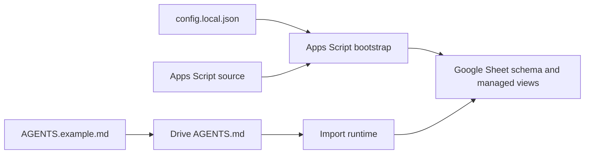
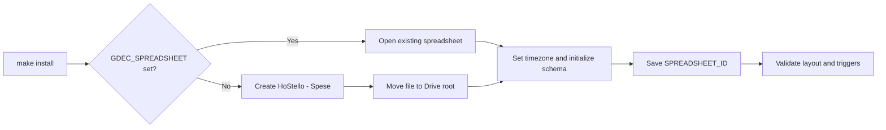
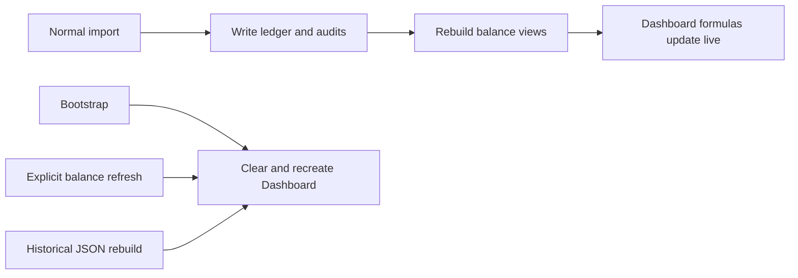

# Spreadsheet Lifecycle and Schema

## Contents

- [Purpose and ownership](#purpose-and-ownership)
- [Initial provisioning](#initial-provisioning)
- [Default schema](#default-schema)
- [Runtime maintenance](#runtime-maintenance)
- [Customization and future migrations](#customization-and-future-migrations)
- [Related documentation](#related-documentation)

## Purpose and ownership

The Google Sheet is the canonical transaction ledger and reporting surface. Its
schema is defined by Apps Script source, not by the `AGENTS.md` file stored in
the Drive intake root.

| Source | Owns | Does not own |
| --- | --- | --- |
| Apps Script | Sheet names, required headers, formulas, derived views, and managed charts | Per-installation intake policy text |
| `config.local.json` | Locale, timezone, and allowed category taxonomy passed at bootstrap | Required transaction columns or chart layout |
| Drive `AGENTS.md` | Import policy for eligible JSON, deduplication, classification, and archiving | Spreadsheet schema |

The runtime reads the Drive policy on every import. It is an operational policy,
not a declarative spreadsheet template. The local template is
[`AGENTS.example.md`](../AGENTS.example.md); the installer merges its managed
section into the existing Drive file without replacing Drive-only instructions.

## Initial provisioning

`make install` starts a resumable local installer. Its Apps Script bootstrap
either creates a spreadsheet named `HoStello - Spese` or adopts the spreadsheet
identified by `GDEC_SPREADSHEET`. When no `GDEC_SPREADSHEET` is supplied, it
creates the file and moves it into the configured Drive root.

The bootstrap then sets the spreadsheet timezone, creates or validates the
managed tabs, writes the configured category taxonomy, creates the managed
dashboard, saves the spreadsheet ID in Script Properties, and validates the
installation. The canonical ID is stored as `SPREADSHEET_ID`.

See the [installation guide](INSTALLATION.md) for prerequisites and the
resumable installer workflow. The [configuration reference](CONFIGURATION.md)
defines the values passed to the bootstrap.

## Default schema

For the Italian locale, the installer manages these tabs. English installations
use localized names but the same roles.

| Tab | Role | Lifecycle |
| --- | --- | --- |
| `Transazioni` | Canonical transaction ledger | Durable; required headers are code-owned |
| `Importazioni` | Import audit | Durable; required headers are code-owned |
| `Riconciliazioni sorgenti` | Source-file reconciliation audit | Durable; required headers are code-owned |
| `Configurazione` | Category and subcategory taxonomy | Rewritten from installation configuration during bootstrap |
| `Movimenti saldi` | Per-participant derived balance movements | Rebuilt from the ledger |
| `Saldi mensili` | Derived monthly balance controls | Rebuilt from the ledger and audit controls |
| `Dashboard` | Managed KPI cards, dynamic queries, and charts | Rebuilt by managed dashboard operations |
| `Analisi personali` | User-owned analysis area | Never cleared or reordered by normal processing |

The Apps Script functions `getInstallerTransactionHeaders_`,
`getInstallerImportAuditHeaders_`, and the localization files define the
required column labels. `Transazioni` is the only canonical transaction data
tab; the other tabs are audit, configuration, or derived reporting surfaces.

## Runtime maintenance

The bootstrap is not the only schema check. During processing, the runtime
validates the ledger layout and can append missing canonical headers when the
existing headers are an exact compatible prefix. It rejects renamed, reordered,
or otherwise incompatible required headers rather than guessing how to write
financial data.

Normal imports write `Transazioni`, `Importazioni`, and `Riconciliazioni
sorgenti`, then rebuild the two balance views. The dashboard's KPI cards and
chart sources are `QUERY` formulas over the full ledger columns. Their technical
source ranges are hidden from the visible dashboard and separated horizontally,
so an expanding result for a new month, year, or category cannot overlap another
summary block. Existing charts therefore update without rebuilding the dashboard
on every import.

The following operations rebuild the full managed dashboard, clearing its cells
and removing its charts before recreating them:

- installation bootstrap;
- explicit `refreshBalanceViews()`;
- `rebuildTransactionsFromTricountJson` after its final ledger replacement.

Deploying Apps Script source alone does not change spreadsheet data, schema, or
Drive policy. See the [deployment guide](DEPLOYMENT.md) for that boundary.

## Customization and future migrations

Do not rename, reorder, or manually repurpose required columns in the ledger
or audit tabs. They are an Apps Script contract. User-owned tabs are currently
outside the managed layout and are not cleared by the runtime.

The current implementation has no versioned spreadsheet-migration registry.
Future default changes should therefore be implemented in Apps Script as
idempotent migrations with these rules:

1. Add missing tabs, columns, formulas, or managed charts without deleting
   compatible existing data.
2. Fail safely on incompatible core headers instead of overwriting them.
3. Keep user analysis in `Analisi personali` (or its localized name), separate
   from the project-managed dashboard.
4. Limit dashboard resets to explicitly project-managed ranges and charts.

This allows a new installation to receive the complete default layout while an
existing installation receives only safe additive improvements. Until that
migration layer exists, manual content in `Dashboard`, `Configurazione`, and
the two derived balance tabs must be treated as replaceable managed content.

For operational effects of imports and rebuilds, see the
[operations guide](OPERATIONS.md).

## Related documentation

- [Project overview and documentation index](../README.md)
- [Installation guide](INSTALLATION.md)
- [Configuration reference](CONFIGURATION.md)
- [Operations guide](OPERATIONS.md)
- [Deployment guide](DEPLOYMENT.md)
