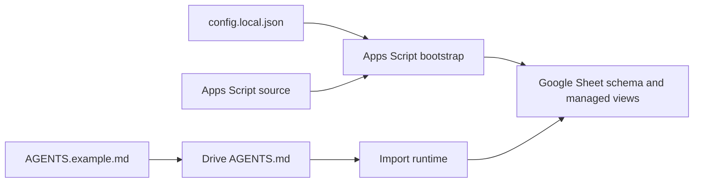
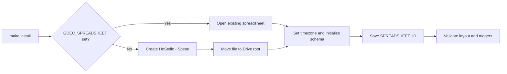
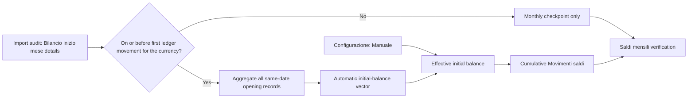
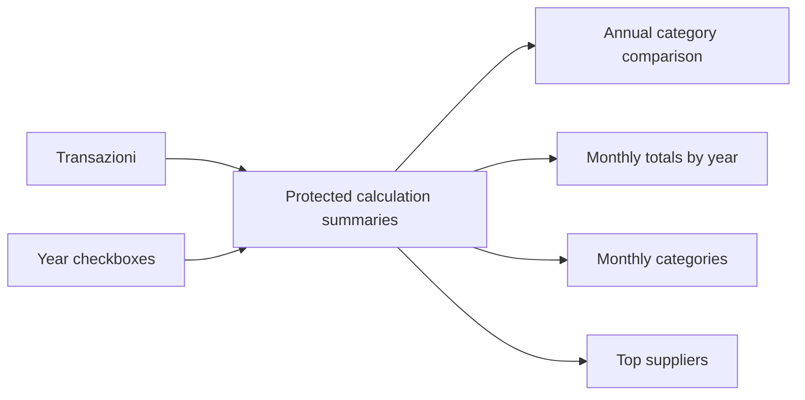
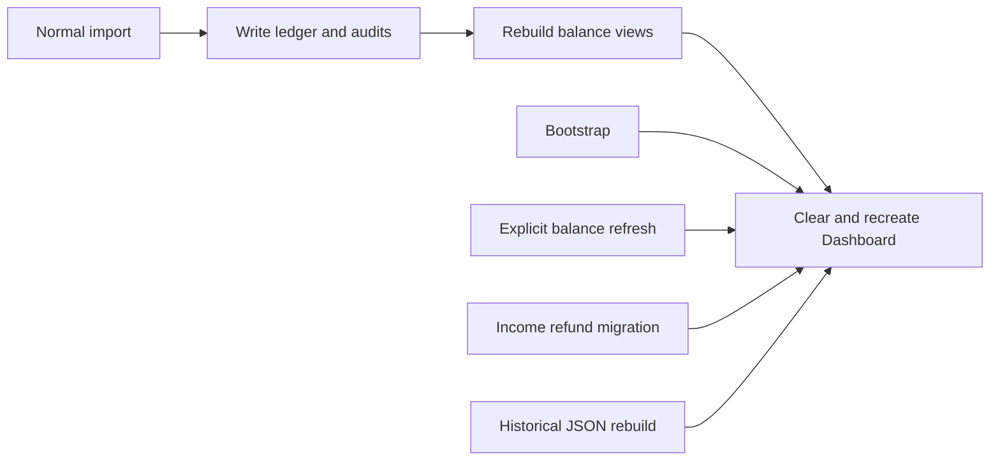

# Spreadsheet Lifecycle and Schema

## Contents

- [Purpose and ownership](#purpose-and-ownership)
- [Initial provisioning](#initial-provisioning)
- [Default schema](#default-schema)
- [Initial-balance model](#initial-balance-model)
- [Dashboard controls and charts](#dashboard-controls-and-charts)
- [Runtime maintenance](#runtime-maintenance)
- [Customization and future migrations](#customization-and-future-migrations)
- [Related documentation](#related-documentation)

## Purpose and ownership

The Google Sheet is the canonical transaction ledger and reporting surface. Its
schema is defined by Apps Script source, not by the `AGENTS.md` file stored in
the Drive intake root.

| Source | Owns | Does not own |
| --- | --- | --- |
| Apps Script | Sheet names, required headers, formulas, derived views, and managed charts | Per-installation intake policy text |
| `config.local.json` | Locale, timezone, and allowed category taxonomy passed at bootstrap | Required transaction columns or chart layout |
| Drive `AGENTS.md` | Import policy for eligible JSON, deduplication, classification, and archiving | Spreadsheet schema |

The runtime reads the Drive policy on every import. It is an operational policy,
not a declarative spreadsheet template. The local template is
[`AGENTS.example.md`](../AGENTS.example.md); the installer merges its managed
section into the existing Drive file without replacing Drive-only instructions.

## Initial provisioning

`make install` starts a resumable local installer. Its Apps Script bootstrap
either creates a spreadsheet named `HoStello - Spese` or adopts the spreadsheet
identified by `GDEC_SPREADSHEET`. When no `GDEC_SPREADSHEET` is supplied, it
creates the file and moves it into the configured Drive root.

The bootstrap then sets the spreadsheet timezone, creates or validates the
managed tabs, writes the configured category taxonomy, creates the managed
dashboard, saves the spreadsheet ID in Script Properties, and validates the
installation. The canonical ID is stored as `SPREADSHEET_ID`.

See the [installation guide](INSTALLATION.md) for prerequisites and the
resumable installer workflow. The [configuration reference](CONFIGURATION.md)
defines the values passed to the bootstrap.

## Default schema

For the Italian locale, the installer manages these tabs. English installations
use localized names but the same roles.

| Tab | Role | Lifecycle |
| --- | --- | --- |
| `Transazioni` | Canonical transaction ledger | Durable; required headers are code-owned |
| `Importazioni` | Import audit | Durable; required headers are code-owned |
| `Riconciliazioni sorgenti` | Source-file reconciliation audit | Durable; required headers are code-owned |
| `Configurazione` | Category taxonomy and editable initial-balance table | Taxonomy is rewritten at bootstrap; manually marked balance rows persist |
| `Movimenti saldi` | Per-participant derived balance movements | Rebuilt from the ledger |
| `Saldi mensili` | Derived monthly balance controls | Rebuilt from the ledger and audit controls |
| `Dashboard` | Managed KPI cards, dynamic queries, and charts | Rebuilt by managed dashboard operations |
| `Analisi personali` | User-owned analysis area | Contents are never cleared; its tab position is restored to the managed order |

The Apps Script functions `getInstallerTransactionHeaders_`,
`getInstallerImportAuditHeaders_`, and the localization files define the
required column labels. `Transazioni` is the only canonical transaction data
tab; the other tabs are audit, configuration, or derived reporting surfaces.

## Initial-balance model

Normal intake treats neither balance marker as spending and inserts neither
into `Transazioni`. `Bilancio inizio mese` and unqualified legacy `Bilancio`
markers are opening-balance controls. For each currency, all opening records on
the earliest usable date form one multi-participant opening-balance vector. It
is applied once to the cumulative calculation; subsequent opening records are
checkpoints in `Saldi mensili`. The cumulative trajectory must reproduce each
following opening vector when all real transactions are included and balance
markers are excluded. `Bilancio fine mese` is recognized and ignored entirely
by the spending and balance calculations because its following opening marker
is the authoritative checkpoint. Legacy opening markers that were originally
exported as `NORMAL` and imported into `Transazioni` are normalized back into
controls and excluded from the cumulative movement. Named non-monthly
`BALANCE` settlements remain transfers.

Spending reports always use the original transaction date. Balance
reconciliation instead assigns rows from a strict monthly
`transactions-hostello-YYYYMM.json` source to that Tricount period. This keeps
a backdated or forward-dated row on the correct side of its source's opening
checkpoint. Combined multi-month sources continue to use their transaction
dates. A materially mistyped filename period can be corrected by the opening
marker date. Other Tricount `BALANCE` entries remain participant transfers
unless they are explicit month-end markers.

If a subsequent checkpoint differs only by a zero-sum rounding residual (at
most 0.25 EUR per participant), the derived
`Movimenti saldi` view adds a visible checkpoint-rounding alignment row. It
never changes `Transazioni`; larger or non-zero-sum discrepancies remain
`mismatch` values for investigation. Once a currency has a material mismatch,
later checkpoints cannot be rounded or reported as matched until the earlier
divergence is resolved.

The editable table is below the category taxonomy in `Configurazione` and has
these fields:
`Data saldo iniziale`, `Valuta`, `Partecipante`, `Saldo iniziale`, `Origine`,
`Attivo`, and `Note`. Set `Origine` to `Manuale` to override the automatic
value for the same currency and participant. The automatic rows are rebuilt,
but manual rows are retained. `Assunto: zero` is used only when no usable
opening-balance vector exists for that currency.

Only a balance vector dated on or before the earliest ledger movement for that
currency can become the automatic starting point. A later monthly balance
cannot be added to the running total without counting the same position twice,
so it remains a reconciliation checkpoint. Importing an older historical export
therefore replaces the automatic baseline safely; importing a newer one does
not.

## Dashboard controls and charts

`Dashboard` is a managed reporting surface. It presents KPI cards and five
charts sourced from formula blocks in the visible, protected `Calculation data`
sheet (localized as `Dati tecnici` in Italian installations). The source blocks
recalculate from `Transazioni` when the ledger changes. Spending charts and
spending KPI cards use EUR `expense` rows and `income` rows whose derived
income-reporting type is `refund`. Signed income that is pre-existing cash or
an unrelated receipt remains visible in `Transazioni`, but is excluded from
spending reports. Transfers and opening-balance controls remain excluded. The
dashboard itself contains only user-facing controls and charts; no technical
tables are hidden in remote columns.

`Trattamento report entrata` / `Income reporting type` is a controlled ledger
override with `refund` and `non_spending` values. The importer seeds it
conservatively and preserves a valid existing value during later repairs, so a
confirmed purchase refund can be included without treating every incoming
payment as a reduction in spending.

The top area has six equally sized KPI cards: all-time spending, expense count,
current-calendar-year spending, current-calendar-year transaction count, latest
imported month, and latest-month spending. Current-year spending uses a distinct
purple palette and latest-month cards use green.

Cash settlements recorded in Tricount (for example with the custom category
`Contanti`) are classified as `transfer`: they remain visible in
`Transazioni` and affect participant balances, but never increase the reported
spending for a month, year, category, payer, or supplier.

| Visible control or chart | Behavior |
| --- | --- |
| `Anni da confrontare` | Three-cell control at `V9:X100`: year, checkbox, and editable color dropdown. Rows `11:100` support up to 90 comparison years. A first installation checks every available ledger year; later refreshes retain a valid user selection. The chosen color is applied to year-series charts. New ledger years appear automatically after their first successful import. |
| Spesa annua per categoria | Each selected year has one native horizontal label with its EUR spending total; transfers and opening-balance controls remain excluded. Colors and legend identify categories. |
| Confronto spese mensili per anno | January through December on the horizontal axis; one connected, color-coded 12-point line with visible markers per selected year, with zeroes for months without spending. Year colors come from `Anni da confrontare`. |
| Andamento mensile per categoria | January through December on the horizontal axis; colors and legend identify categories summed across the selected comparison years. Months without spending remain visible with zero values. |
| Spesa per pagatore | Payers on the horizontal axis; one column per selected comparison year, using the colors from `Anni da confrontare`. |
| Top 20 esercenti / fornitori | Suppliers summed across the selected comparison years and ordered by spending, highest first. Empty supplier values are grouped as `Unspecified merchant` (localized for the installation). Each supplier is a chart row with one differently coloured horizontal bar; the legend is hidden and the chart has the same height as `Andamento mensile per categoria`. |

The comparison-year control occupies three cells and ends at column X, matching
the right edge of the dashboard. Changing a checkbox updates every chart
immediately; a managed edit trigger reapplies the chosen year colors after
checkbox or color changes. More
than 90 distinct ledger years exceeds the managed control and chart contract,
so refresh stops with an explicit error instead of omitting years. The last
chart replaces the former dog-subcategory chart, while the former
monthly-balance chart is no longer shown on the dashboard because its
accounting-control purpose was not clear in a spending view. The underlying
`Saldi mensili` tab remains available for reconciliation.

## Runtime maintenance

The bootstrap is not the only schema check. During processing, the runtime
validates the ledger layout and can append missing canonical headers when the
existing headers are an exact compatible prefix. It rejects renamed, reordered,
or otherwise incompatible required headers rather than guessing how to write
financial data.

Normal imports write `Transazioni`, `Importazioni`, and `Riconciliazioni
sorgenti`, then rebuild the two balance views. The dashboard's KPI cards and
chart sources are `QUERY` formulas over the full ledger columns. Their technical
source ranges are hidden from the visible dashboard and separated into reserved
row blocks,
so an expanding result for a new month, year, or category cannot overlap another
summary block. Control changes update the formula sources without rebuilding the
dashboard. Each successful import then rebuilds the managed dashboard so newly
present years are added to the controls. The year controls preserve their
selected values when a managed dashboard rebuild occurs, provided those years
are still present in the ledger.

The following operations rebuild the full managed dashboard, clearing its cells
and removing its charts before recreating them:

- installation bootstrap;
- every successful normal import;
- explicit `refreshBalanceViews()`;
- `categorizeIncomeRefunds()` when it changes legacy rows;
- `rebuildTransactionsFromTricountJson` after its final ledger replacement.

Deploying Apps Script source alone does not change spreadsheet data, schema, or
Drive policy. See the [deployment guide](DEPLOYMENT.md) for that boundary.

## Customization and future migrations

Do not rename, reorder, or manually repurpose required columns in the ledger
or audit tabs. They are an Apps Script contract. User-owned tabs are currently
outside the managed layout and are not cleared by the runtime.

The current implementation has no versioned spreadsheet-migration registry.
Future default changes should therefore be implemented in Apps Script as
idempotent migrations with these rules:

1. Add missing tabs, columns, formulas, or managed charts without deleting
   compatible existing data.
2. Fail safely on incompatible core headers instead of overwriting them.
3. Keep user analysis in `Analisi personali` (or its localized name), separate
   from the project-managed dashboard.
4. Limit dashboard resets to explicitly project-managed ranges and charts.

This allows a new installation to receive the complete default layout while an
existing installation receives safe additive changes to durable ledger and
audit schemas. The dashboard and derived balance tabs are rebuilt managed
content; category taxonomy and automatic balance rows are managed too, while
`Configurazione` rows marked `Manuale` are preserved.

For operational effects of imports and rebuilds, see the
[operations guide](OPERATIONS.md).

## Related documentation

- [Project overview and documentation index](../README.md)
- [Installation guide](INSTALLATION.md)
- [Configuration reference](CONFIGURATION.md)
- [Operations guide](OPERATIONS.md)
- [Deployment guide](DEPLOYMENT.md)
